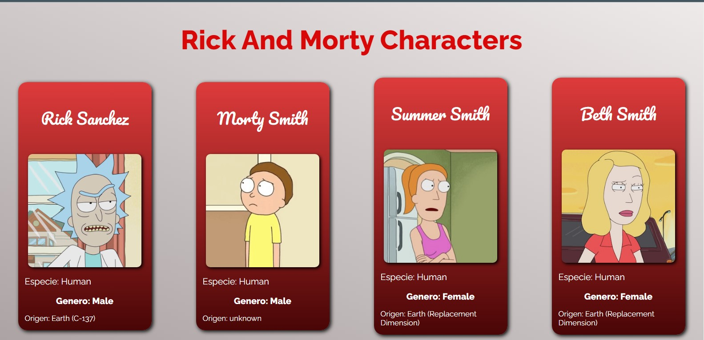

#Consumo de API REST - Rick and Morty  
Esta pequeña app esta construida en html, css y javascript.  
[Rick and Morty Characters]('https://olarte910903.github.io/API-Rest-rick-and-morty/')

---

Su funcionalidad es sencilla, por medio de el método `fetch()` obtenemos los datos de los personajes de la API pública [**Rick and Morty API**](https://rickandmortyapi.com/)  

---

En el archivo `components.js` tenemos una función `createComponent()` que recibe por paràmetro los datos a mostrar, como por ejemplo: Nombre, la url de imagen. Esta función se exporta, para posteriormente ser importada en el archivo `script.js` el cual hace la solicitud a la API y por medio del método `forEach()` recorre los datos que va a tomar cada componente creado posteriormente.
